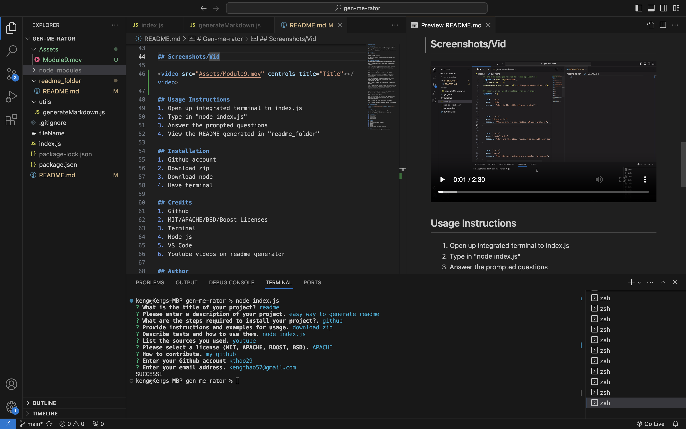
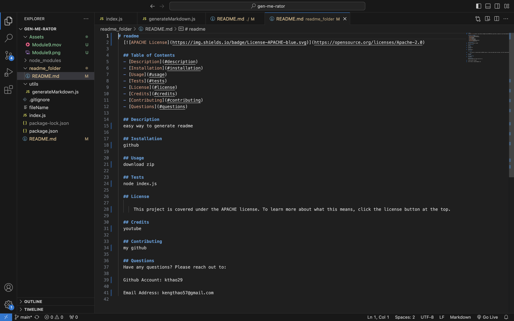

# Gen-me-rator

## Description
This README generator makes it easy for a user to quickly generate a professional README for any project they are working on. The generator will ask the user multiple questions and then take the responses to the questions and put it into a README file.

## User Story
AS A developer

I WANT a README generator

SO THAT I can quickly create a professional README for a new project

## Acceptance Criteria
GIVEN a command-line application that accepts user input

WHEN I am prompted for information about my application repository

THEN a high-quality, professional README.md is generated with the title of my project and sections entitled Description, Table of Contents, Installation, Usage, License, Contributing, Tests, and Questions

WHEN I enter my project title

THEN this is displayed as the title of the README

WHEN I enter a description, installation instructions, usage information, contribution guidelines, and test instructions

THEN this information is added to the sections of the README entitled Description, Installation, Usage, Contributing, and Tests

WHEN I choose a license for my application from a list of options

THEN a badge for that license is added near the top of the README and a notice is added to the section of the README entitled License that explains which license the application is covered under

WHEN I enter my GitHub username

THEN this is added to the section of the README entitled Questions, with a link to my GitHub profile

WHEN I enter my email address

THEN this is added to the section of the README entitled Questions, with instructions on how to reach me with additional questions

WHEN I click on the links in the Table of Contents

THEN I am taken to the corresponding section of the README

## Screenshots/Vid

<video src="Assets/Vid.mp4" controls title="Title"></video>

## Usage Instructions
1. Open up integrated terminal to index.js
2. Type in "node index.js"
3. Answer the prompted questions
4. View the README generated in "readme_folder"

## Installation
1. Github account
2. Download zip
3. Download node
4. Have terminal

## Credits
1. Github
2. MIT/APACHE/BSD/Boost Licenses
3. Terminal
4. Node js
5. VS Code
6. Youtube videos on readme generator

## Author
My Github account: https://github.com/Kthao29